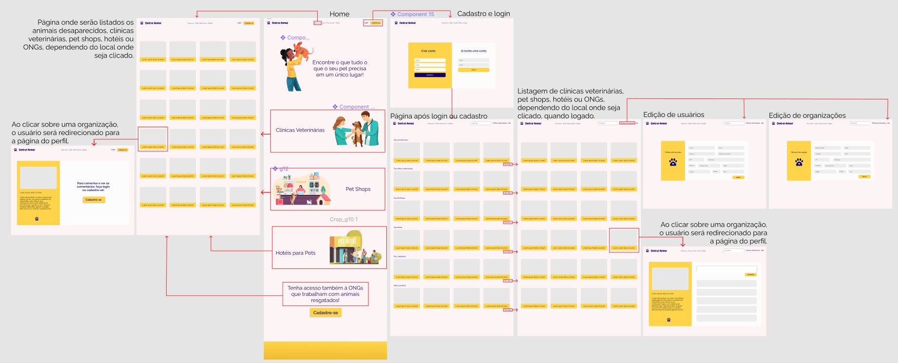

# Projeto de Interface

## User Flow

## Wireframes

A tela da home informa brevemento tudo o que o site fornece aos usuários, e contem os seguintes elementos:

> - Cabeçalho: A logo so site, os links de Procura-se, Sobre, Quem somos e Contato. E os botôes de login e cadastro.
