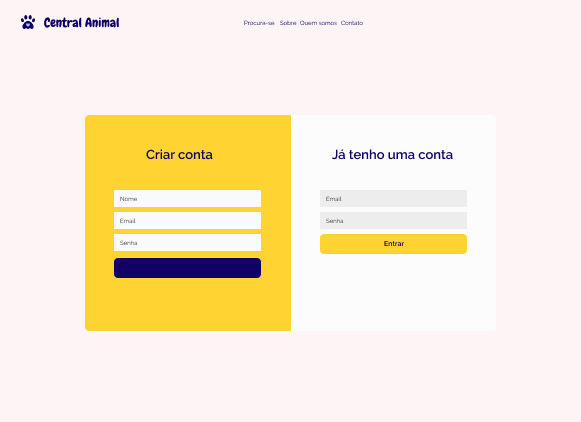

# Projeto de Interface

## User Flow

## Wireframes

A tela da home informa brevemento tudo o que o site fornece aos usuários, e contem os seguintes elementos:

> - Cabeçalho: A logo so site, os links de Procura-se, Sobre, Quem somos e Contato. E os botôes de login e cadastro.
> - A página também vai conter as informações que são encontradas no site, ao clicar sobre "Clínicas Veterinárias" por exemplo, o usuário será encaminhado para a página onde serão listadas todas as clínicas, do mesmo modo acontecerá com os outros tópicos na página.

---

- Tela de listagem das organizações, dependendo de onde o usuário clicou. Essa tela será exibida mesmo quando os usuários não estiverem logados.

---

- Tela onde será informações individuis com mais detalhes, poderá ser acessada ao clicar em cima de uma organização. Quando não estiver logado, o usuário não poderá visualizar, e nem deixar comentários.

---

- A tela de login e cadastro serão as mesmas para usuários e organizações, a diferenciação será feita com a opção "Quero oferecer meus serviços", ao selecionada essa opção, o formulário renderizará mais um campo onde será informado qual tipo de serviço oferecido.

---

- Página na qual o usuário será redirecionado após o cadastro ou login.

---

- Tela de listagem das organizações, dependendo de onde o usuário clicou. Essa tela será exibida quando o usuário já está logado.

---

- Tela onde será informações individuis com mais detalhes, poderá ser acessada ao clicar em cima de uma organização. Quando logado, o usuário poderá visualizar e deixar comentários.

---

- Página onde os usuários poderão editar suas informações.

---

- Página onde organizações poderão editar suas informações.
