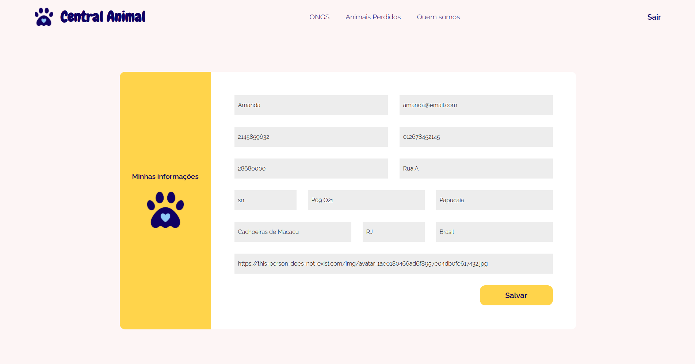
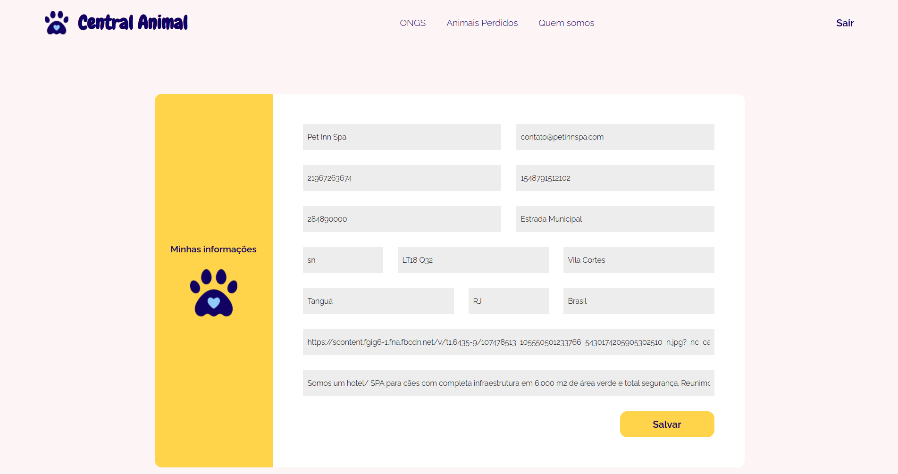

# Programação de Funcionalidades

- Página inicial (RF-01 e RF-02)

> Feito por: Amanda Cacholi (header e footer), Marcus Vinicius Ferreira


Requisitos atendidos

- RF-01
- RF-02

Artefatos da funcionalidade

- index.html
- styles.css
- reset.css

Instruções de acesso

1. Abrir index.html

- Tela de cadastro e login (RF-03 e RF-04)

> Feito por: Amanda Cacholi


Requisitos atendidos

- RF-03
- RF-04

Artefatos da funcionalidade

- cadastro-login.html
- cadastro-login.css
- cadastro-login.js
- reset.css

Estrutura de dados

```
    {
      id: string,
      name: string,
      email: string,
      password: string,
      isOrganization: boolean,
      service: string,
      cnpj: string,
      description: string,
      image: string,
      address: {},
      comments: [],
      ranking: number,
    }
```

Instruções de acesso

1. Abrir index.html
2. Clicar em "Login" ou "Cadastre-se"
3. Realizar um cadastro ou fazer login
4. Conferir informações inseridas no local storage

- Telas de listagens

> Feito por: Marcus Vinícius (layout) e Amanda Cacholi (integração com local storage)


Requisitos atendidos

- RF-05

Artefatos da funcionalidade

- animais-perdidos.html
- animais-perdidos.css
- animais-perdidos.js
- veterinarios.html
- veterinarios.css
- veterinarios.js
- orgs.html
- orgs.css
- orgs.js
- pet-hotel.html
- pet-hotel.css
- pet-hotel.js
- pet-shops.html
- pet-shops.css
- pet-shops.js

- Tela de edição de cadastro

> Feito por: Amanda Cacholi




Requisitos atendidos

- RF-07

Artefatos da funcionalidade

- editar-cadastro.html
- editar-cadastro.css
- editar-cadastr0.js

Instruções de acesso

1. Abrir index.html
2. Clicar em "Login" ou "Cadastre-se"
3. Realizar um cadastro ou fazer login
4. A partir da página inicial após o login, clicar em "Minhas informações"
5. Adicionar novas informações
6. Conferir se novas informações foram salvas no local storage
